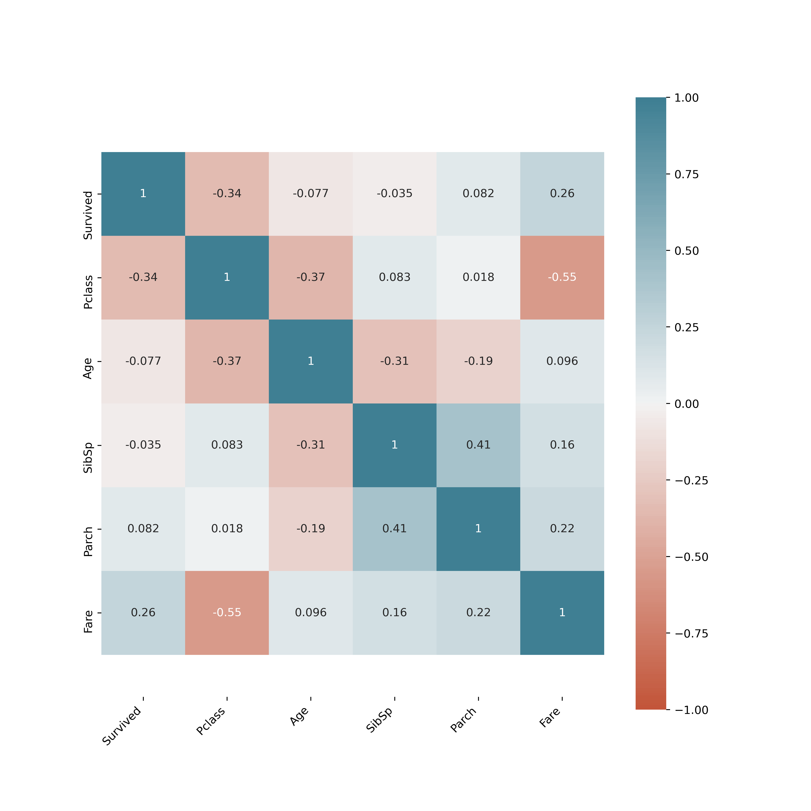
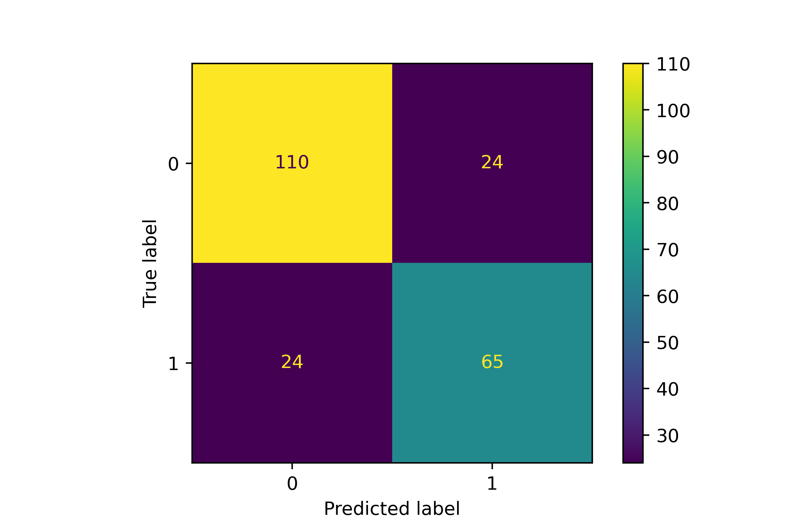
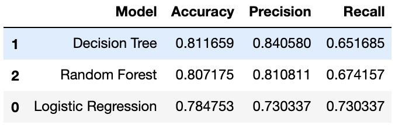

# Classification Models on the Titanic dataset from kaggle
 **This project is about classification with ScikitLearn on the Titanic dataset**
 - Logistic Regression
 - Decision Trees
 - Random Forest
## 1.Data Visualitsation and Feature Engineering (FE)
 - Correlation of the features gives us important imformations to decide which features could be used in different models.
 
 - Feature engineering techniques affects our model's efficiency.
    1. `OneHotEncoder()` for Categorical / Ordinal variables. It encodes values to several one-hot-columns(0,1).
    2. `SimpleImputer()` for Metric(Mean) / Categorical(Mod) / Ordinal (Mode). It imputes values according to Mean, Mode etc.
    ### Transformation Pipeline
    - It helps to use several FE techniques to a feature/column at the same time.

        `make_pipeline()` -> you can find the example of usage in titanic.ipynb
    ### The ColumnTransformer
    - Applies specified transformations to different columns of pandas DataFrame.

        `ColumnTransformer([(name, transformer, column-names)])` -> you can find the example of usage in titanic.ipynb

## 2.Machine Learning Models
 **The process to apply a model on the transformed data is the same for all models used in this project**
  1. Initialize the Model -> `model = LogisticRegression()`
  2. Fit the model -> `model.fit(X_train, y_train)`
  3. Predict -> `y_train_pred = model.predict(X_train)`
  4. Evaluate the model -> Confusion Matrix
 
     There are some different metrics to evaluate the score from confusion matrix
     - accuracy = `metrics.accuracy_score(y_test, y_pred_test)` -> (110+65) / (110 + 65 + 24 + 24)
     - precision = `metrics.precision_score(y_test, y_pred_test)` -> 110 / (110 + 24)
     - recall = `metrics.recall_score(y_test, y_pred_test)` -> 110 / (110 + 24)

## 3.Comparing Accuracy between LogReg, DecisionTrees, RandomForest
    As can be seen, I get the highest score with the DecisionTree according to the feature engineering I made. 

 
